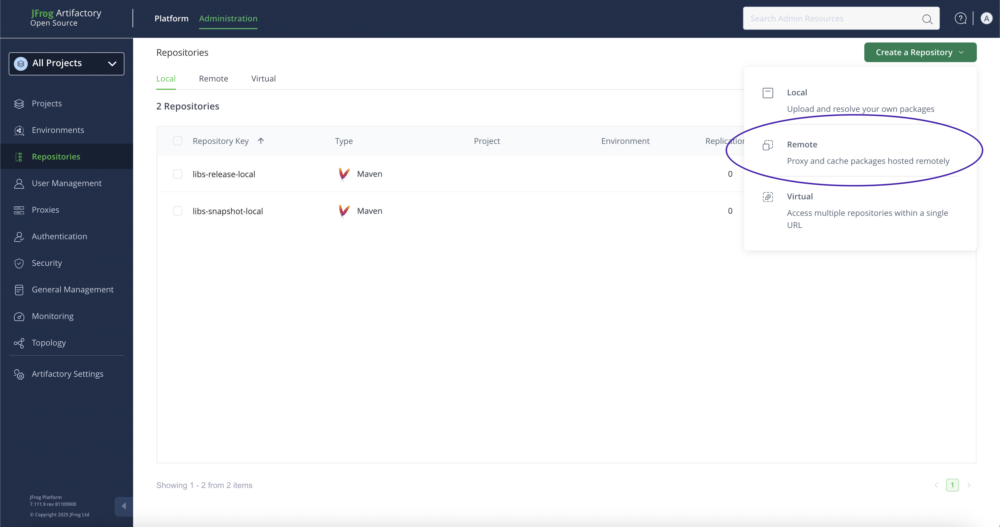
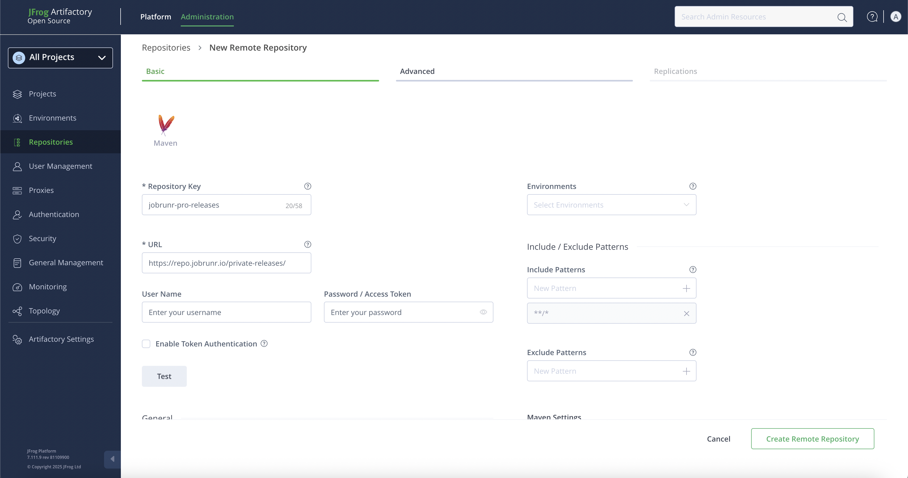
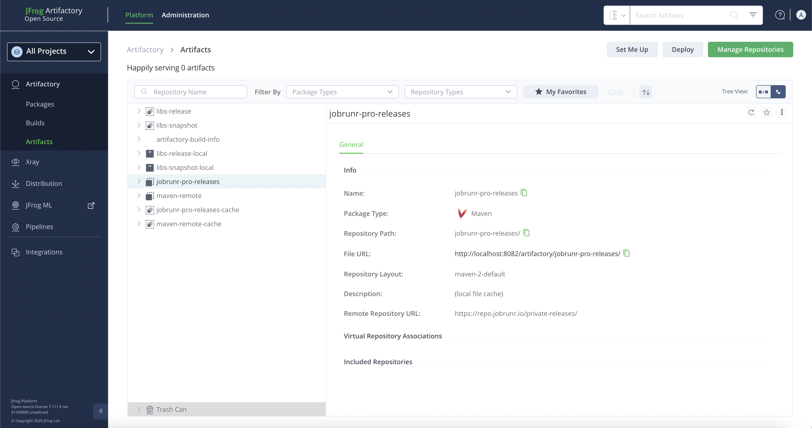

# Proxy JobRunr Pro private releases with JFrog Artifactory

> Disclaimer: Our main focus is showing how to setup a proxy of the JobRunr Pro private releases. Although we show how to start a JFrog server, it's own only because this serves our purpose. It's the end-user's task to make sure they follow the best practices of JFrog.

## Starting a local JFrog Artifactory server

To start a local JFrog Artifactory server, we'll be using the official docker image. The official doc provides detailed steps on how to set it up: https://jfrog.com/help/r/jfrog-installation-setup-documentation/install-artifactory-single-node-with-docker. Here's the gist:

1. Create a directory where JFrog Artifactory data will be saved
```sh 
mkdir ~/jfrog
```

2. Set the JFROG_HOME global variable to this directory
```sh
export JFROG_HOME=~/jfrog
```

3. Create a `system.yaml` file inside `$JFROG_HOME/artifactory/var/etc/`
```sh 
mkdir -p $JFROG_HOME/artifactory/var/etc/ && touch $JFROG_HOME/artifactory/var/etc/system.yaml && sudo chown -R 1030:1030 $JFROG_HOME/artifactory/var
```

macOS only
```sh
sudo chmod -R 777 $JFROG_HOME/artifactory/var
```

4. Start a progress container

```sh
docker run --name postgres -itd -e POSTGRES_USER=artifactory -e POSTGRES_PASSWORD=password -e POSTGRES_DB=artifactorydb -p 5432:5432 library/postgres:latest
```

5. Populate `system.yaml` with the db configuration
```yaml
shared:
  database:
    driver: org.postgresql.Driver
    type: postgresql
    url: jdbc:postgresql://host.docker.internal:5432/artifactorydb
    username: artifactory
    password: password
```

6. Start the Artifactory container using the process

```
docker run --name artifactory -v $JFROG_HOME/artifactory/var/:/var/opt/jfrog/artifactory -d -p 8081:8081 -p 8082:8082 releases-docker.jfrog.io/jfrog/artifactory-oss:latest
```
 

And we're done. The application may need a few minutes to start. To make sure it has started run:

```sh
docker logs -f artifactory
```


## Setup the JobRunr Pro private releases proxy

Let's head over to [http://localhost:8082](http://localhost:8082). Since we did a fresh restart we need to complete a few mandatory initial configuration. 

Note that the default username is `admin` and the default password is `password`.

Then we can execute the following steps to setup the proxy.

1. Configure the proxy

Click on the `Administration` tab, then in the sidebar, click on `Repositories` in sidebar. On the page you'll find a button `Create a Repository` that opens a dropdown, choose to create a `Remote` repository. The image below shows the steps.



In the popup, select Maven as repository type. Then fill the form that follows; in addition to the mandatory fields, you need to provide the JobRunr Pro private releases URL, i.e., https://repo.jobrunr.io/private-releases/ and fill the username and password fields with the credentials we've shared with you.



This it! We've provided the minimum required configuration for JFrog to proxy the private releases.

> Note: Clicking on the `Test` button will show an error but the configuration actually works.

## Update your build tool configuration

You can find the summary of the information needed for your build tool to connect to the proxy, i.e., the name of the repository and its url by going back  to `Platform` section and clicking on `Artifacts` under the `Artifactory` tab in the sidebar.



Using this information, you can proceed and configure your build tool as you'd usually do.

In our tests, we use the credentials of the admin, please make sure the user you usually use has access to this newly added repository proxy.