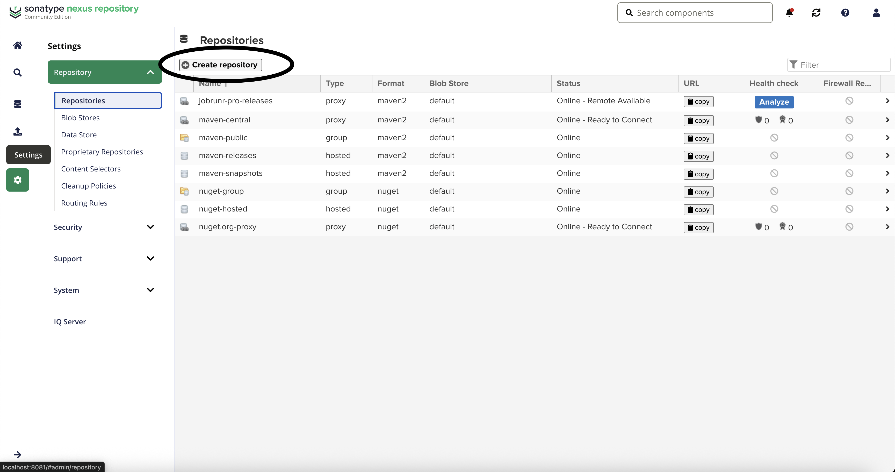
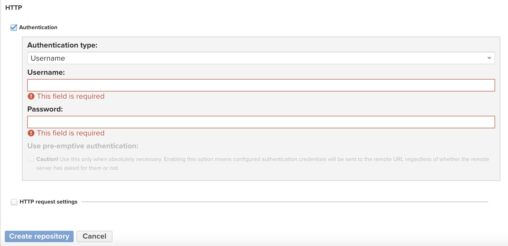
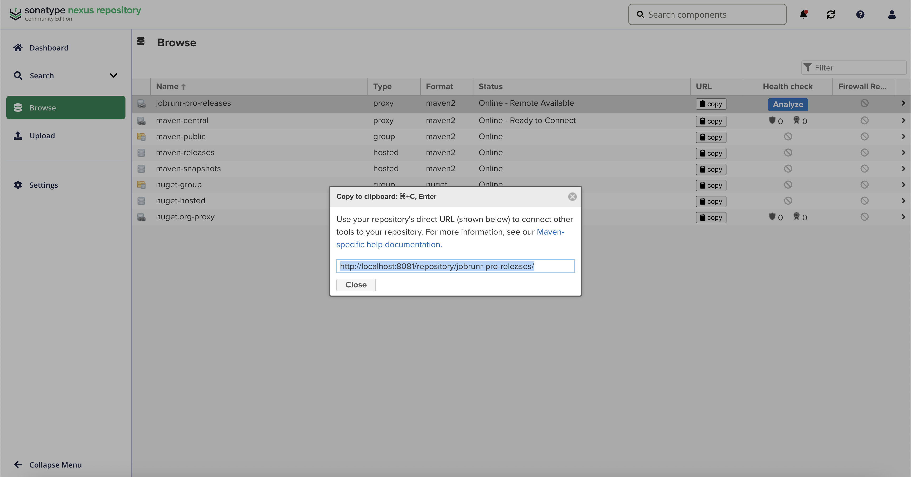

# Proxy JobRunr Pro private releases with Sonatype Nexus Repository

> Please make sure your **proxy is only available by your company**, i.e., should not be accessible publicly by anonymous users!

> Disclaimer: Our main focus is showing how to setup a proxy of the JobRunr Pro private releases. Although we show how to start a Sonatype Nexus Repository server, it's own only because this serves our purpose. It's the end-user's task to make sure the configuration follows their internal security policy and the best practices from Reposilite.

## Starting a local Sonatype Nexus Repository server

To start a local Sonatype Nexus Repository server, we'll be using the official docker image that you can find at https://hub.docker.com/r/sonatype/nexus3/.

Start the container as follows:

```sh
docker run -d -p 8081:8081 --name nexus sonatype/nexus3
```

This starts a server exposed on port 8081.

## Setup the JobRunr Pro private releases proxy

Let's head over to [http://localhost:8081](http://localhost:8081).

Nexus creates a default user for us: `admin`. We'll need to login with this user if we want to make changes and create our proxy. But first we need to know the password:

```sh
docker exec -it nexus cat /nexus-data/admin.password 
```

Running this will output the password to use.

Once we're logged in, with our fresh installation, we need to complete a few steps, e.g., changing the password.

> Where is the login button? Well, yes, the login button is the `exit`-like icon at the top right...

Then we can execute the following steps to setup the proxy.

1. Configure the proxy

In the sidebar, on the `Settings` icon, then, expand the `Repositories` dropdown and select `Repositories`. At the top of the page click on `Create repository`.



This will initiate the creation of our the proxy repository. After the click, we're prompted to choose a `Recipe`, scroll down until you find `maven2 (proxy)`. Select it.

From there, for our demonstration purposes, we'll only fill in the mandatory fields and enable authentication:
1. The `Name` field, you're free to enter a name to your liking
2. The `Remote Storage` field, enter the URL to JobRunr Pro private releases
3. Scroll down to the `Http` section and check the `Authentication` checkbox
4. Fill the username and password fields with the credentials we've shared with you



This it! We've provided the minimum required configuration for Sonatype Nexus Repository to proxy the private releases.

> Additionally we also made sure `Anonymous Access` is disabled. This can be done by going to `Settings > Security > Anonymous Access`.

## Update your build tool configuration

You can find the summary of the information needed for your build tool to connect to the proxy, i.e., the name of the repository and its url by going back  to the `Browse` page. The URL can be copied by clicking on the `copy` button in the `URL` column.



Using this information, you can proceed and configure your build tool as you'd usually do.

> In our tests, we use the credentials of the admin, please make sure the user you usually use has access to this newly added repository proxy.