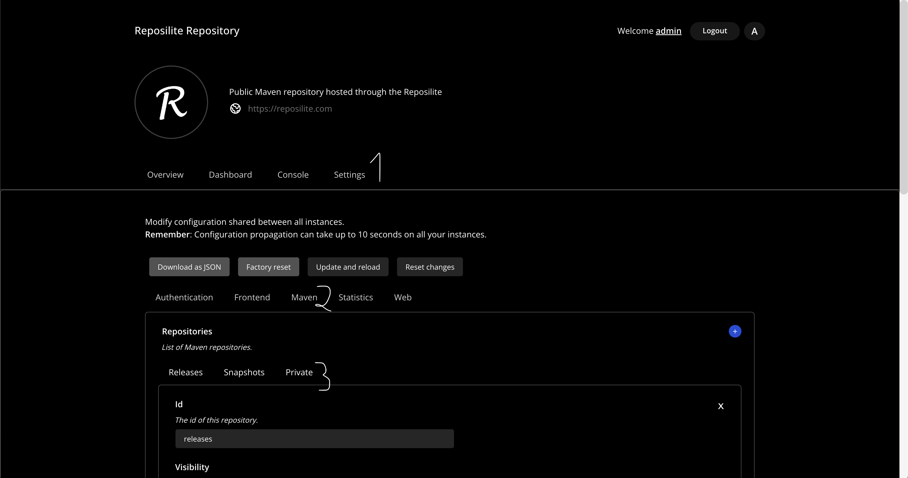
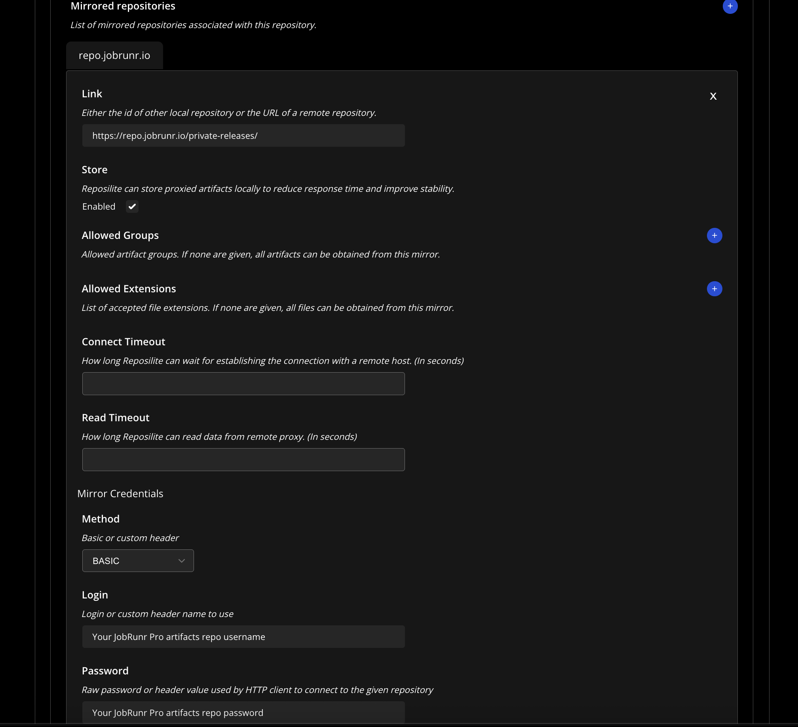
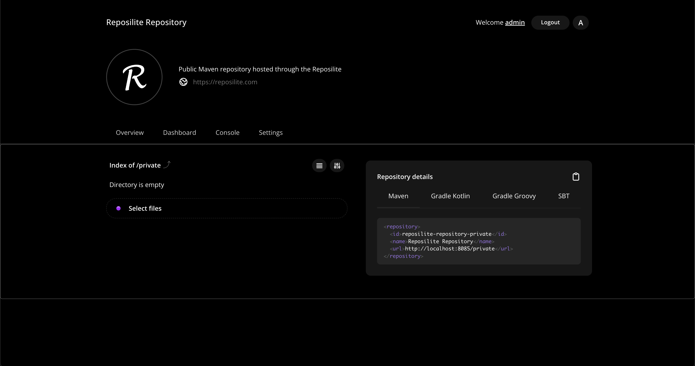

# Proxy JobRunr Pro private releases with Reposilite

> Please make sure your **proxy is only available by your company**, i.e., should not be accessible publicly by anonymous users!

> Disclaimer: Our main focus is showing how to setup a proxy of the JobRunr Pro private releases. Although we show how to start a Reposilite server, it's own only because this serves our purpose. It's the end-user's task to make sure the configuration follows their internal security policy and the best practices from Reposilite.

## Starting a local Reposilite server

To start a local Reposilite server, we'll be using the official docker image and docker compose for extra configuration. The official doc provides detailed steps on how to set it up: https://reposilite.com/guide/docker#using-docker-compose. You may use this as a starting `docker-compose`:

```yaml
version: "3.9"
services:
  reposilite:
    image: dzikoysk/reposilite:3.5.23
    ports:
      - "8085:8080"
    environment:
      REPOSILITE_OPTS: '--token admin:reallyH@RDs3cr3t'
    volumes:
      - ./reposilite-data:/app/data
    restart: unless-stopped
    stdin_open: true
    tty: true
volumes:
  reposilite-data: {}
```

Run `docker compose up` to start the container. This should expose the reposilite dashboard on port 8085.

> As highlighted in the docs, you must not forget to update the password.


## Setup the JobRunr Pro private releases proxy

Let's head over to [http://localhost:8085](http://localhost:8085).

We login using the default credentials we've provided above. Note that the default username is `admin` and the default password is `reallyH@RDs3cr3t`.

Then we can execute the following steps to setup the proxy.

1. Configure the proxy

Click on the `Settings` tab, then, click on `Maven`. On the page you'll find a button `Private` to add a new mirrored repositories.

> Note you can also add a new repository configuration by clicking on the `+` button.



Move to the bottom of the page to add a new mirror by clicking on the `+` button. The Reposilite documentation details of the available options when creating mirrors: https://reposilite.com/guide/mirrors. Let's add a mirror to the JobRunr Pro private repository.

Fill the form that appears after clicking the `+` button. You need to provide the JobRunr Pro private releases URL, i.e., https://repo.jobrunr.io/private-releases/ and fill the username and password fields with the credentials we've shared with you. Select `Basic` as authentication method and make sure to enable `Store` to cache the artifacts.



This it! We've provided the minimum required configuration for Reposilite to proxy the private releases.

## Update your build tool configuration

You can find the summary of the information needed for your build tool to connect to the proxy, i.e., the name of the repository and its url by going back  to the `Overview` page and clicking on the `private` repository.



Using this information, you can proceed and configure your build tool as you'd usually do.

> In our tests, we use the credentials of the admin, please make sure the user you usually use has access to this newly added repository proxy.